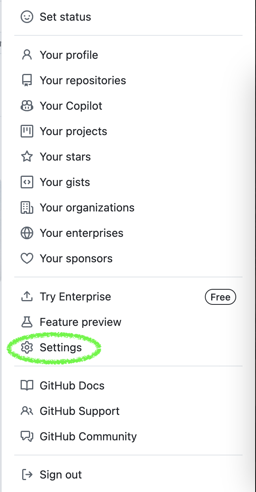
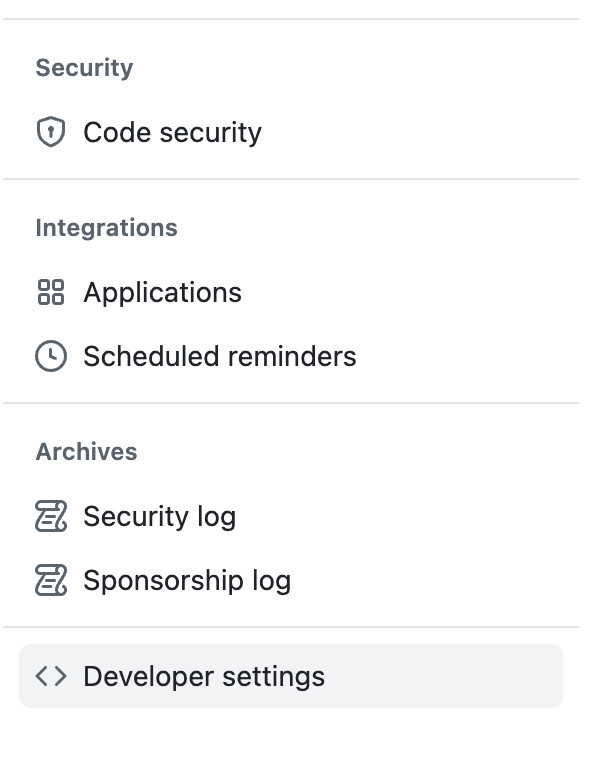
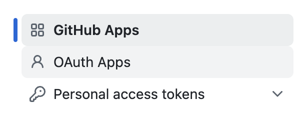
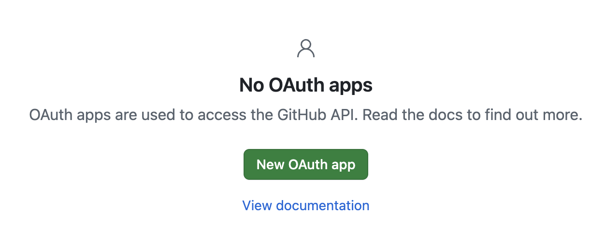
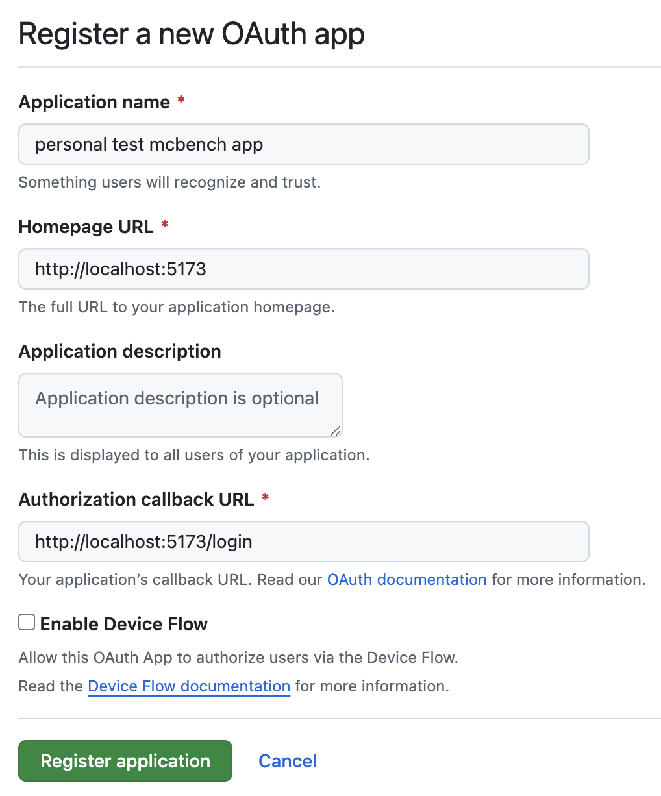
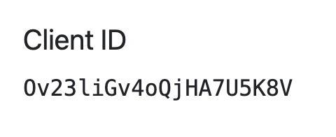
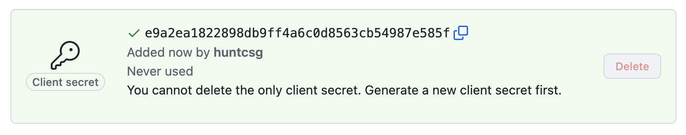

# Setup OAuth Pre-Requisites

We use the OAuth 2.0 protocol for authentication and support the following identity providers:

- Github

In order to run the frontend and backend in development, you must create test OAuth Apps and set the proper environment variables.

## Setting Up a Github OAuth App

### 1. Navigate to your Github settings

### 2. On the lefthand side at the bottom, find the developer settings

### 3. In the top left, choose OAuth Apps

### 4. Select New Oauth App

### 5. Configure the application

Application Name: Anything you want, like, "local mcbench"

Homepage URL: http://localhost:5173

Application description: Not important

Authorization callback URL: http://localhost:5173/login

### 6. Save your Client ID for use in `.env` for both mc-bench-frontend and mc-bench-backend

### 7. Generate a client secret and save the secret for use in `.env` in the mc-bench-backend repo

### 8. You're all set up! Proceed with the directions to set up the rest of the frontend and backend! Good luck!
